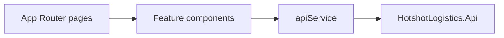

# Admin dashboard architecture

## Overview

The admin dashboard is a Next.js App Router UI for dispatchers: jobs, drivers, tracking, billing, and login. It is a presentation client of the API. It does not own SQL access or domain invariants.

## Architecture

TanStack Query caches server state. MSAL handles Azure AD sign-in. SignalR connects to the API `/realtime` hub for live updates.

## Components and interfaces

| Area | Path |
| --- | --- |
| Shell | `src/app/layout.tsx` |
| Jobs | `src/app/jobs/page.tsx`, `JobsManagement` |
| Drivers | `src/app/drivers/page.tsx` |
| Tracking | `src/app/tracking/page.tsx` |
| Billing | `src/app/billing/page.tsx` |
| Login | `src/app/(auth)/login/page.tsx` |
| Auth | `src/components/auth/` |
| HTTP | `src/services/api.ts` |

## Data models

Shared TypeScript types live in `src/types`. They mirror API DTOs; the API remains the source of truth.

## Error handling

Query and mutation errors surface in the feature components. Auth failures redirect through the MSAL / protected-route wrappers.

## Testing strategy

Playwright specs under `tests/` cover auth, dashboard overview, jobs, drivers, tracking, and billing. Run `npm test` from the dashboard source root.
