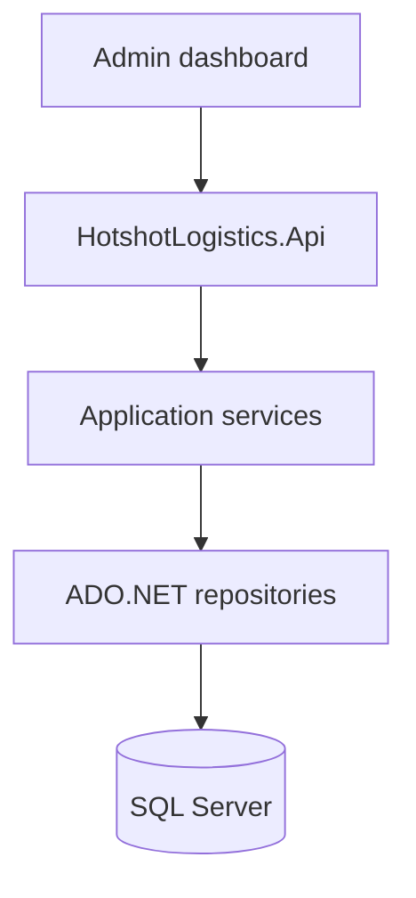

# API architecture

## Overview

`HotshotLogistics.Api` is an ASP.NET Core Web API hosted on Azure Container Apps. It is the HTTP and SignalR edge for jobs, drivers, customers, billing, tracking, and assignments. It depends on Application, Domain, and Persistence; it does not own business invariants.

## Architecture

`Program` wires user secrets, optional Azure App Configuration, repository and application DI, authentication, CORS, controllers, and `RealtimeHub` at `/realtime`.

## Components and interfaces

| Surface | Role |
| --- | --- |
| `JobController` and sibling controllers under `Controllers/` | HTTP API, route prefix `api/[controller]` |
| `TestAuthHandler` | Development and test authentication |
| JWT Bearer + Microsoft Identity Web | Non-development Azure AD B2C |
| `ExceptionHandlingMiddleware` | Structured error responses (ProblemDetails-style payloads) |
| Application `RealtimeHub` | Real-time updates mapped from the API host |

Authorization policies include `Admin`, `Manager`, `Driver`, `Customer`, and combined roles.

## Data models

Request and response DTOs live in Domain. Persistence uses native ADO.NET. See [data access](../data-access.md).

## Error handling

Controllers and `ExceptionHandlingMiddleware` map validation and domain exceptions to HTTP status codes. Do not return secrets or stack traces to clients in production.

## Testing strategy

API tests live under `5-Test/` (`HotshotLogistics.Api.Tests`, integration tests). The `Program` type is public (`Program.Api.cs`) so the test host can use the real composition root.
