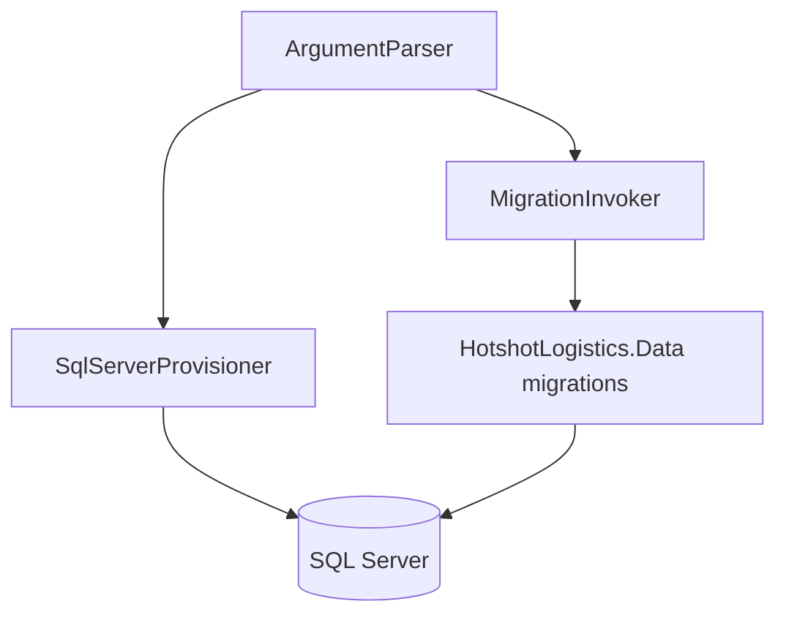

# DbSetup architecture

## Overview

DbSetup is a .NET 8 console tool that creates the SQL Server database, login, and application user, then applies FluentMigrator migrations from Persistence. It is not a runtime service.

## Architecture

`Program` composes `ArgumentParser`, `EnvironmentManager`, `PasswordManager`, `SqlServerProvisioner`, and `MigrationInvoker`.

## Components and interfaces

| Type | Role |
| --- | --- |
| `ArgumentParser` | CLI flags and environment overrides |
| `SqlServerProvisioner` | CREATE DATABASE / LOGIN / USER, grants, rollback |
| `MigrationInvoker` | FluentMigrator in-process or MigrationRunner subprocess |
| `PasswordManager` | Generated passwords; never logged in full |
| `SecureLogger` | Structured logging with secret masking |
| Tests | `7-Deployment/DbSetup/HotshotLogistics.DbSetup.Tests` |

## Data models

No application entities. The tool talks to SQL Server catalog views (`sys.databases`, `sys.server_principals`) and the target database.

## Error handling

Provisioning catches failures, logs them, rolls back created artifacts, and exits non-zero. Migration failures fail the run.

## Testing strategy

Unit tests sit beside the tool project. Integration coverage that needs a real SQL Server is opt-in; do not embed credentials in test projects.
