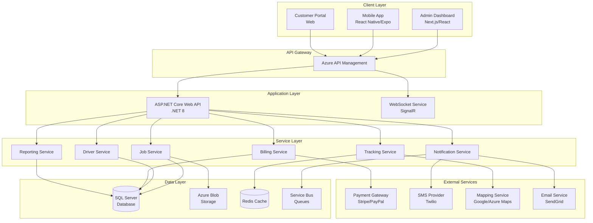
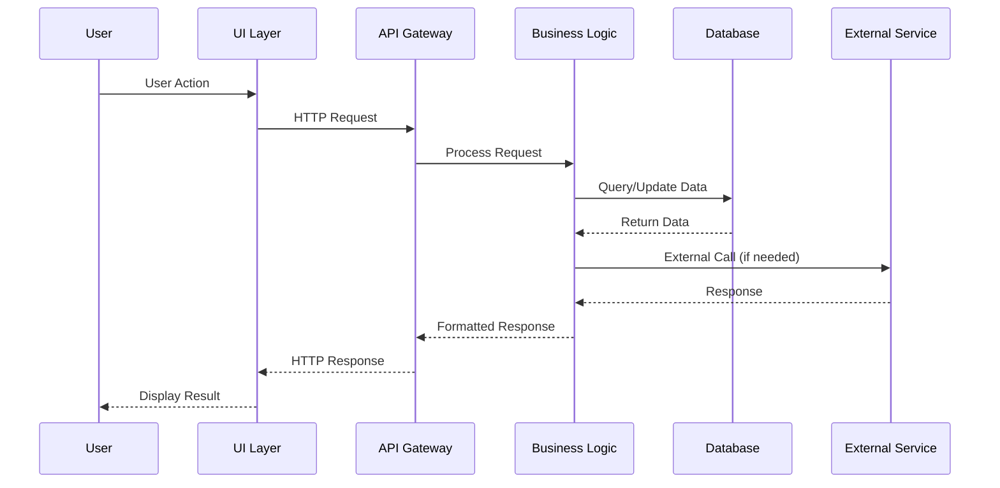
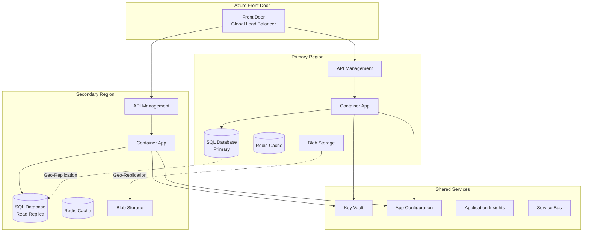

# Hotshot Logistics Platform - Design Document

## Overview

The Hotshot Logistics Platform is designed as a comprehensive, cloud-native solution built on Microsoft Azure infrastructure following Clean Architecture principles. The system consists of three main components: a React/Next.js admin dashboard, a React Native/Expo mobile application for drivers, and a .NET 8 backend using ASP.NET Core Web API hosted on Azure Container Apps. This design emphasizes scalability, maintainability, and real-time operations through modern architectural patterns and cloud services.

### Design Principles

- **Clean Architecture**: Strict separation of concerns with defined layers (Domain, Application, Infrastructure, Presentation)
- **Domain-Driven Design**: Business logic encapsulated in application services with clear domain boundaries
- **Event-Driven Architecture**: Real-time updates through WebSocket connections and event sourcing
- **Microservices-Ready**: Modular design allowing future decomposition into microservices
- **API-First Development**: RESTful APIs with comprehensive OpenAPI documentation
- **Security by Design**: Defense-in-depth with authentication, authorization, and encryption at all levels

## Architecture

### System Architecture



### Layered Architecture

Following the numbered folder structure defined in the project:

```
0-Base/
  └── Core utilities, base classes, cross-cutting concerns
  
1-Presentation/
  └── API Controllers, SignalR Hubs, Request/Response DTOs
  
2-Application/
  └── Business Logic, Use Cases, Application Services, Validators
  
3-Domain/
  └── Domain Models, Contracts, DTOs, Repository Interfaces
  
4-Persistence/
  └── Native ADO.NET repositories (Microsoft.Data.SqlClient) and FluentMigrator for schema & migrations
  
5-Test/
  └── Unit Tests, Integration Tests, Test Utilities
  
6-Docs/
  └── Documentation, Specifications, API Documentation
  
7-Deployment/
  └── Infrastructure as Code, Docker, CI/CD Pipelines
```

### Data Flow Architecture



## Components and Interfaces

### Core Domain Models

#### Customer Domain
```csharp
public interface ICustomer {
    string Id { get; set; }
    string CompanyName { get; set; }
    string TaxId { get; set; }
    Address BillingAddress { get; set; }
    List<Contact> Contacts { get; set; }
    CreditTerms CreditTerms { get; set; }
    decimal CreditLimit { get; set; }
    bool IsActive { get; set; }
}

public interface IInvoice {
    string Id { get; set; }
    string CustomerId { get; set; }
    string JobId { get; set; }
    DateTime InvoiceDate { get; set; }
    DateTime DueDate { get; set; }
    InvoiceStatus Status { get; set; }
    List<LineItem> LineItems { get; set; }
    decimal SubTotal { get; set; }
    decimal TaxAmount { get; set; }
    decimal TotalAmount { get; set; }
    PaymentTerms Terms { get; set; }
}
```

#### Enhanced Job Domain
```csharp
public interface IJob {
    string Id { get; set; }
    string CustomerId { get; set; }
    string Title { get; set; }
    Location PickupLocation { get; set; }
    Location DeliveryLocation { get; set; }
    CargoDetails Cargo { get; set; }
    JobStatus Status { get; set; }
    JobPriority Priority { get; set; }
    PricingDetails Pricing { get; set; }
    DateTime ScheduledPickupTime { get; set; }
    DateTime EstimatedDeliveryTime { get; set; }
    string SpecialInstructions { get; set; }
    List<JobDocument> Documents { get; set; }
    TrackingInfo Tracking { get; set; }
}

public class Location {
    public string Address { get; set; }
    public double Latitude { get; set; }
    public double Longitude { get; set; }
    public string ContactName { get; set; }
    public string ContactPhone { get; set; }
}

public class TrackingInfo {
    public List<LocationUpdate> Updates { get; set; }
    public string CurrentStatus { get; set; }
    public DateTime LastUpdateTime { get; set; }
    public double EstimatedDistance { get; set; }
    public TimeSpan EstimatedTimeRemaining { get; set; }
}
```

#### Enhanced Driver Domain
```csharp
public interface IDriver {
    int Id { get; set; }
    PersonalInfo PersonalInfo { get; set; }
    LicenseInfo License { get; set; }
    VehicleInfo Vehicle { get; set; }
    List<Certification> Certifications { get; set; }
    AvailabilitySchedule Availability { get; set; }
    PerformanceMetrics Performance { get; set; }
    PaymentInfo PaymentDetails { get; set; }
    bool IsActive { get; set; }
    DriverStatus CurrentStatus { get; set; }
}

public class PerformanceMetrics {
    public decimal OnTimeDeliveryRate { get; set; }
    public decimal CustomerRating { get; set; }
    public int CompletedJobs { get; set; }
    public int CancelledJobs { get; set; }
    public decimal TotalMilesDriven { get; set; }
    public decimal AverageDeliveryTime { get; set; }
}
```

### Service Layer Interfaces

#### Job Management Service
```csharp
public interface IJobService {
    Task<JobDto> CreateJobAsync(CreateJobRequest request);
    Task<JobDto> UpdateJobAsync(string jobId, UpdateJobRequest request);
    Task<bool> AssignDriverAsync(string jobId, int driverId);
    Task<JobDto> GetJobAsync(string jobId);
    Task<PagedResult<JobDto>> GetJobsAsync(JobFilterRequest filter);
    Task<bool> UpdateJobStatusAsync(string jobId, JobStatus status);
    Task<RouteOptimizationResult> OptimizeRouteAsync(string jobId);
    Task<EstimatedDeliveryTime> CalculateETAAsync(string jobId);
}
```

#### Billing Service
```csharp
public interface IBillingService {
    Task<Invoice> GenerateInvoiceAsync(string jobId);
    Task<Invoice> CreateCustomInvoiceAsync(CreateInvoiceRequest request);
    Task<bool> SendInvoiceAsync(string invoiceId);
    Task<PaymentResult> ProcessPaymentAsync(string invoiceId, PaymentDetails payment);
    Task<Invoice> ApplyPaymentAsync(string invoiceId, decimal amount);
    Task<List<Invoice>> GetOverdueInvoicesAsync();
    Task<bool> ApplyLateFeeAsync(string invoiceId);
    Task<AccountStatement> GenerateStatementAsync(string customerId, DateRange period);
    Task<TaxCalculation> CalculateTaxAsync(string jobId);
}
```

#### Real-Time Tracking Service
```csharp
public interface ITrackingService {
    Task StartTrackingAsync(string jobId, int driverId);
    Task UpdateLocationAsync(string jobId, LocationUpdate update);
    Task<CurrentLocation> GetCurrentLocationAsync(string jobId);
    Task<List<LocationUpdate>> GetTrackingHistoryAsync(string jobId);
    Task<string> GenerateTrackingLinkAsync(string jobId);
    Task NotifyDeviationAsync(string jobId, RouteDeviation deviation);
    Task<bool> StopTrackingAsync(string jobId);
}
```

#### Notification Service
```csharp
public interface INotificationService {
    Task SendSmsAsync(string phoneNumber, string message);
    Task SendEmailAsync(EmailMessage email);
    Task SendPushNotificationAsync(int userId, PushMessage message);
    Task SendJobUpdateAsync(string jobId, JobUpdateType updateType);
    Task SendInvoiceReminderAsync(string invoiceId);
    Task<NotificationPreferences> GetUserPreferencesAsync(int userId);
    Task UpdatePreferencesAsync(int userId, NotificationPreferences preferences);
    Task<List<NotificationHistory>> GetNotificationHistoryAsync(int userId);
}
```

### API Endpoints Design

#### RESTful API Structure
```
/api/v1/
├── /auth
│   ├── POST /login
│   ├── POST /logout
│   ├── POST /refresh
│   └── POST /reset-password
├── /jobs
│   ├── GET /
│   ├── POST /
│   ├── GET /{id}
│   ├── PUT /{id}
│   ├── DELETE /{id}
│   ├── POST /{id}/assign
│   ├── PUT /{id}/status
│   ├── GET /{id}/tracking
│   └── POST /{id}/optimize-route
├── /drivers
│   ├── GET /
│   ├── POST /
│   ├── GET /{id}
│   ├── PUT /{id}
│   ├── GET /{id}/availability
│   ├── GET /{id}/performance
│   └── GET /{id}/documents
├── /customers
│   ├── GET /
│   ├── POST /
│   ├── GET /{id}
│   ├── PUT /{id}
│   ├── GET /{id}/jobs
│   └── GET /{id}/invoices
├── /billing
│   ├── POST /invoices
│   ├── GET /invoices/{id}
│   ├── POST /invoices/{id}/send
│   ├── POST /payments
│   ├── GET /statements/{customerId}
│   └── GET /reports/accounts-receivable
├── /tracking
│   ├── POST /start
│   ├── POST /update
│   ├── GET /{jobId}
│   └── GET /{jobId}/history
└── /analytics
    ├── GET /dashboard
    ├── GET /reports/driver-performance
    ├── GET /reports/job-metrics
    └── GET /reports/financial
```

### WebSocket Events (SignalR)
```csharp
public interface IRealtimeHub {
    // Server to Client Events
    Task JobStatusUpdated(string jobId, JobStatus status);
    Task LocationUpdated(string jobId, LocationUpdate location);
    Task DriverStatusChanged(int driverId, DriverStatus status);
    Task NewJobAvailable(JobDto job);
    Task NotificationReceived(NotificationMessage message);
    
    // Client to Server Methods
    Task JoinJobTracking(string jobId);
    Task LeaveJobTracking(string jobId);
    Task UpdateDriverStatus(DriverStatus status);
    Task AcceptJob(string jobId);
    Task DeclineJob(string jobId);
}
```

## Data Models

### Database Schema

#### Core Tables
```sql
-- Customers Table
CREATE TABLE Customers (
    Id NVARCHAR(50) PRIMARY KEY,
    CompanyName NVARCHAR(200) NOT NULL,
    TaxId NVARCHAR(50),
    BillingAddress NVARCHAR(500),
    City NVARCHAR(100),
    State NVARCHAR(50),
    ZipCode NVARCHAR(20),
    Country NVARCHAR(100),
    CreditLimit DECIMAL(18,2),
    PaymentTerms INT, -- Days (NET 15/30/45/60)
    IsActive BIT DEFAULT 1,
    CreatedAt DATETIME2 DEFAULT GETUTCDATE(),
    UpdatedAt DATETIME2
);

-- Enhanced Jobs Table
CREATE TABLE Jobs (
    Id NVARCHAR(50) PRIMARY KEY,
    CustomerId NVARCHAR(50) FOREIGN KEY REFERENCES Customers(Id),
    Title NVARCHAR(200) NOT NULL,
    PickupAddress NVARCHAR(500),
    PickupLatitude DECIMAL(10,7),
    PickupLongitude DECIMAL(10,7),
    DeliveryAddress NVARCHAR(500),
    DeliveryLatitude DECIMAL(10,7),
    DeliveryLongitude DECIMAL(10,7),
    CargoDescription NVARCHAR(1000),
    CargoWeight DECIMAL(10,2),
    CargoValue DECIMAL(18,2),
    Status INT NOT NULL, -- Enum: JobStatus
    Priority INT NOT NULL, -- Enum: JobPriority
    BaseRate DECIMAL(18,2),
    MileageRate DECIMAL(10,4),
    TotalAmount DECIMAL(18,2),
    ScheduledPickupTime DATETIME2,
    EstimatedDeliveryTime DATETIME2,
    ActualPickupTime DATETIME2,
    ActualDeliveryTime DATETIME2,
    AssignedDriverId INT FOREIGN KEY REFERENCES Drivers(Id),
    SpecialInstructions NVARCHAR(MAX),
    CreatedAt DATETIME2 DEFAULT GETUTCDATE(),
    UpdatedAt DATETIME2,
    INDEX IX_Jobs_Status (Status),
    INDEX IX_Jobs_CustomerId (CustomerId),
    INDEX IX_Jobs_AssignedDriverId (AssignedDriverId)
);

-- Enhanced Drivers Table  
CREATE TABLE Drivers (
    Id INT IDENTITY(1,1) PRIMARY KEY,
    FirstName NVARCHAR(100) NOT NULL,
    LastName NVARCHAR(100) NOT NULL,
    Email NVARCHAR(255) UNIQUE NOT NULL,
    PhoneNumber NVARCHAR(20),
    LicenseNumber NVARCHAR(50) NOT NULL,
    LicenseState NVARCHAR(2),
    LicenseExpiryDate DATE,
    LicenseClass NVARCHAR(10),
    VehicleType NVARCHAR(50),
    VehicleMake NVARCHAR(50),
    VehicleModel NVARCHAR(50),
    VehicleYear INT,
    VehiclePlateNumber NVARCHAR(20),
    InsurancePolicyNumber NVARCHAR(50),
    InsuranceExpiryDate DATE,
    CurrentStatus INT, -- Enum: Available, Busy, Offline
    IsActive BIT DEFAULT 1,
    HourlyRate DECIMAL(10,2),
    PerMileRate DECIMAL(10,4),
    CreatedAt DATETIME2 DEFAULT GETUTCDATE(),
    UpdatedAt DATETIME2,
    INDEX IX_Drivers_Email (Email),
    INDEX IX_Drivers_CurrentStatus (CurrentStatus)
);

-- Invoices Table
CREATE TABLE Invoices (
    Id NVARCHAR(50) PRIMARY KEY,
    InvoiceNumber NVARCHAR(50) UNIQUE NOT NULL,
    CustomerId NVARCHAR(50) FOREIGN KEY REFERENCES Customers(Id),
    JobId NVARCHAR(50) FOREIGN KEY REFERENCES Jobs(Id),
    InvoiceDate DATE NOT NULL,
    DueDate DATE NOT NULL,
    Status INT NOT NULL, -- Draft, Sent, Paid, Overdue, Cancelled
    SubTotal DECIMAL(18,2),
    TaxRate DECIMAL(5,4),
    TaxAmount DECIMAL(18,2),
    DiscountAmount DECIMAL(18,2),
    TotalAmount DECIMAL(18,2),
    PaidAmount DECIMAL(18,2) DEFAULT 0,
    BalanceDue AS (TotalAmount - PaidAmount),
    Notes NVARCHAR(MAX),
    CreatedAt DATETIME2 DEFAULT GETUTCDATE(),
    UpdatedAt DATETIME2,
    INDEX IX_Invoices_CustomerId (CustomerId),
    INDEX IX_Invoices_Status (Status),
    INDEX IX_Invoices_DueDate (DueDate)
);

-- Invoice Line Items
CREATE TABLE InvoiceLineItems (
    Id INT IDENTITY(1,1) PRIMARY KEY,
    InvoiceId NVARCHAR(50) FOREIGN KEY REFERENCES Invoices(Id),
    Description NVARCHAR(500),
    Quantity DECIMAL(10,2),
    UnitPrice DECIMAL(18,4),
    Amount AS (Quantity * UnitPrice),
    TaxApplicable BIT DEFAULT 1
);

-- Payments Table
CREATE TABLE Payments (
    Id NVARCHAR(50) PRIMARY KEY,
    InvoiceId NVARCHAR(50) FOREIGN KEY REFERENCES Invoices(Id),
    PaymentDate DATETIME2,
    Amount DECIMAL(18,2),
    PaymentMethod INT, -- CreditCard, ACH, Check, Cash
    TransactionId NVARCHAR(100),
    ProcessorResponse NVARCHAR(MAX),
    Status INT, -- Pending, Completed, Failed, Refunded
    CreatedAt DATETIME2 DEFAULT GETUTCDATE()
);

-- Location Tracking Table
CREATE TABLE LocationTracking (
    Id BIGINT IDENTITY(1,1) PRIMARY KEY,
    JobId NVARCHAR(50) FOREIGN KEY REFERENCES Jobs(Id),
    DriverId INT FOREIGN KEY REFERENCES Drivers(Id),
    Latitude DECIMAL(10,7),
    Longitude DECIMAL(10,7),
    Speed DECIMAL(5,2),
    Heading INT,
    Accuracy DECIMAL(5,2),
    Timestamp DATETIME2,
    INDEX IX_LocationTracking_JobId (JobId),
    INDEX IX_LocationTracking_Timestamp (Timestamp)
);

-- Documents Table
CREATE TABLE Documents (
    Id NVARCHAR(50) PRIMARY KEY,
    EntityType NVARCHAR(50), -- Driver, Job, Customer, Invoice
    EntityId NVARCHAR(50),
    DocumentType NVARCHAR(50), -- License, Insurance, POD, Invoice
    FileName NVARCHAR(255),
    FileSize BIGINT,
    MimeType NVARCHAR(100),
    StorageUrl NVARCHAR(500),
    ExpiryDate DATE,
    UploadedAt DATETIME2 DEFAULT GETUTCDATE(),
    UploadedBy NVARCHAR(50),
    INDEX IX_Documents_EntityType_EntityId (EntityType, EntityId)
);

-- Notifications Table
CREATE TABLE Notifications (
    Id BIGINT IDENTITY(1,1) PRIMARY KEY,
    RecipientId NVARCHAR(50),
    RecipientType NVARCHAR(50), -- Driver, Customer, Admin
    Type NVARCHAR(50), -- SMS, Email, Push
    Subject NVARCHAR(500),
    Message NVARCHAR(MAX),
    Status INT, -- Pending, Sent, Failed, Delivered
    SentAt DATETIME2,
    DeliveredAt DATETIME2,
    FailureReason NVARCHAR(500),
    CreatedAt DATETIME2 DEFAULT GETUTCDATE(),
    INDEX IX_Notifications_RecipientId (RecipientId),
    INDEX IX_Notifications_CreatedAt (CreatedAt)
);

-- Audit Log Table
CREATE TABLE AuditLogs (
    Id BIGINT IDENTITY(1,1) PRIMARY KEY,
    UserId NVARCHAR(50),
    Action NVARCHAR(100),
    EntityType NVARCHAR(50),
    EntityId NVARCHAR(50),
    OldValues NVARCHAR(MAX), -- JSON
    NewValues NVARCHAR(MAX), -- JSON
    IpAddress NVARCHAR(45),
    UserAgent NVARCHAR(500),
    Timestamp DATETIME2 DEFAULT GETUTCDATE(),
    INDEX IX_AuditLogs_UserId (UserId),
    INDEX IX_AuditLogs_EntityType_EntityId (EntityType, EntityId),
    INDEX IX_AuditLogs_Timestamp (Timestamp)
);
```

### Redis Cache Schema
```
Keys Structure:
- job:{jobId} - Job details cache (TTL: 5 minutes)
- driver:{driverId}:location - Current driver location (TTL: 30 seconds)
- driver:{driverId}:status - Driver status (TTL: 1 minute)
- tracking:{jobId} - Real-time tracking data (TTL: 30 seconds)
- user:{userId}:session - User session data (TTL: 30 minutes)
- analytics:dashboard - Dashboard metrics cache (TTL: 1 minute)
```

### Message Queue Schema
```json
// Job Assignment Message
{
  "messageType": "JobAssignment",
  "jobId": "string",
  "driverId": 123,
  "timestamp": "2024-01-01T00:00:00Z",
  "priority": "high"
}

// Status Update Message
{
  "messageType": "StatusUpdate",
  "entityType": "job",
  "entityId": "string",
  "oldStatus": "pending",
  "newStatus": "in_progress",
  "timestamp": "2024-01-01T00:00:00Z"
}

// Notification Message
{
  "messageType": "Notification",
  "recipientId": "string",
  "notificationType": "sms",
  "content": {
    "subject": "string",
    "body": "string"
  },
  "priority": "normal"
}
```

## Error Handling

### Error Response Format
```json
{
  "error": {
    "code": "VALIDATION_ERROR",
    "message": "The request contains invalid data",
    "details": [
      {
        "field": "email",
        "message": "Invalid email format"
      }
    ],
    "timestamp": "2024-01-01T00:00:00Z",
    "traceId": "abc123-def456"
  }
}
```

### Error Codes
```csharp
public enum ErrorCode {
    // Authentication & Authorization (1xxx)
    UNAUTHORIZED = 1001,
    FORBIDDEN = 1002,
    TOKEN_EXPIRED = 1003,
    INVALID_CREDENTIALS = 1004,
    
    // Validation (2xxx)
    VALIDATION_ERROR = 2001,
    REQUIRED_FIELD_MISSING = 2002,
    INVALID_FORMAT = 2003,
    OUT_OF_RANGE = 2004,
    
    // Business Logic (3xxx)
    JOB_NOT_FOUND = 3001,
    DRIVER_NOT_AVAILABLE = 3002,
    INSUFFICIENT_CREDIT = 3003,
    DUPLICATE_INVOICE = 3004,
    
    // System (4xxx)
    INTERNAL_ERROR = 4001,
    SERVICE_UNAVAILABLE = 4002,
    DATABASE_ERROR = 4003,
    EXTERNAL_SERVICE_ERROR = 4004
}
```

### Exception Handling Strategy
```csharp
public class GlobalExceptionMiddleware {
    public async Task InvokeAsync(HttpContext context, RequestDelegate next) {
        try {
            await next(context);
        }
        catch (ValidationException ex) {
            await HandleValidationException(context, ex);
        }
        catch (BusinessException ex) {
            await HandleBusinessException(context, ex);
        }
        catch (UnauthorizedException ex) {
            await HandleUnauthorizedException(context, ex);
        }
        catch (Exception ex) {
            await HandleGenericException(context, ex);
        }
    }
}
```

### Retry Policies
```csharp
// Polly retry configuration
services.AddHttpClient<IExternalService>()
    .AddPolicyHandler(GetRetryPolicy())
    .AddPolicyHandler(GetCircuitBreakerPolicy());

static IAsyncPolicy<HttpResponseMessage> GetRetryPolicy() {
    return HttpPolicyExtensions
        .HandleTransientHttpError()
        .OrResult(msg => !msg.IsSuccessStatusCode)
        .WaitAndRetryAsync(
            3,
            retryAttempt => TimeSpan.FromSeconds(Math.Pow(2, retryAttempt)),
            onRetry: (outcome, timespan, retryCount, context) => {
                // Log retry attempt
            });
}
```

## Testing Strategy

### Unit Testing
```csharp
// Service Layer Test Example
[Fact]
public async Task CreateJob_WithValidData_ReturnsJobDto() {
    // Arrange
    var mockRepo = new Mock<IJobRepository>();
    var mockNotification = new Mock<INotificationService>();
    var service = new JobService(mockRepo.Object, mockNotification.Object);
    var request = new CreateJobRequest { /* valid data */ };
    
    // Act
    var result = await service.CreateJobAsync(request);
    
    // Assert
    Assert.NotNull(result);
    Assert.Equal(request.Title, result.Title);
    mockRepo.Verify(x => x.AddAsync(It.IsAny<Job>()), Times.Once);
    mockNotification.Verify(x => x.SendJobUpdateAsync(It.IsAny<string>(), JobUpdateType.Created), Times.Once);
}
```

### Integration Testing
```csharp
// API Integration Test Example
[Fact]
public async Task POST_Jobs_ReturnsCreatedResult() {
    // Arrange
    var client = _factory.CreateClient();
    var request = new CreateJobRequest { /* test data */ };
    
    // Act
    var response = await client.PostAsJsonAsync("/api/v1/jobs", request);
    
    // Assert
    response.EnsureSuccessStatusCode();
    Assert.Equal(HttpStatusCode.Created, response.StatusCode);
    var job = await response.Content.ReadFromJsonAsync<JobDto>();
    Assert.NotNull(job);
}
```

### Load Testing Configuration
```yaml
# K6 Load Test Script
import http from 'k6/http';
import { check, sleep } from 'k6';

export let options = {
  stages: [
    { duration: '5m', target: 100 },  // Ramp up
    { duration: '10m', target: 100 }, // Stay at 100 users
    { duration: '5m', target: 0 },    // Ramp down
  ],
  thresholds: {
    http_req_duration: ['p(95)<2000'], // 95% of requests under 2s
    http_req_failed: ['rate<0.05'],    // Error rate under 5%
  },
};
```

### Test Data Management
```csharp
public class TestDataBuilder {
    public Job BuildJob(Action<Job> customize = null) {
        var job = new Job {
            Id = Guid.NewGuid().ToString(),
            Title = "Test Delivery",
            Status = JobStatus.Pending,
            // Default values
        };
        customize?.Invoke(job);
        return job;
    }
    
    public Driver BuildDriver(Action<Driver> customize = null) {
        var driver = new Driver {
            Id = _nextDriverId++,
            FirstName = "Test",
            LastName = "Driver",
            // Default values
        };
        customize?.Invoke(driver);
        return driver;
    }
}
```

## Security Design

### Authentication & Authorization
```csharp
// JWT Configuration
services.AddAuthentication(JwtBearerDefaults.AuthenticationScheme)
    .AddJwtBearer(options => {
        options.TokenValidationParameters = new TokenValidationParameters {
            ValidateIssuer = true,
            ValidateAudience = true,
            ValidateLifetime = true,
            ValidateIssuerSigningKey = true,
            ValidIssuer = configuration["Jwt:Issuer"],
            ValidAudience = configuration["Jwt:Audience"],
            IssuerSigningKey = new SymmetricSecurityKey(
                Encoding.UTF8.GetBytes(configuration["Jwt:Key"]))
        };
    });

// Role-based authorization
[Authorize(Roles = "Admin,Manager")]
public class JobManagementController : ControllerBase { }

[Authorize(Roles = "Driver")]
public class DriverPortalController : ControllerBase { }
```

### Data Encryption
```csharp
public class EncryptionService : IEncryptionService {
    private readonly IConfiguration _configuration;
    
    public string Encrypt(string plainText) {
        using var aes = Aes.Create();
        aes.Key = GetEncryptionKey();
        aes.GenerateIV();
        
        var encryptor = aes.CreateEncryptor();
        var encrypted = encryptor.TransformFinalBlock(
            Encoding.UTF8.GetBytes(plainText), 0, plainText.Length);
        
        return Convert.ToBase64String(aes.IV.Concat(encrypted).ToArray());
    }
    
    public string Decrypt(string cipherText) {
        // Decryption implementation
    }
}
```

### API Security Headers
```csharp
public class SecurityHeadersMiddleware {
    public async Task InvokeAsync(HttpContext context, RequestDelegate next) {
        context.Response.Headers.Add("X-Content-Type-Options", "nosniff");
        context.Response.Headers.Add("X-Frame-Options", "DENY");
        context.Response.Headers.Add("X-XSS-Protection", "1; mode=block");
        context.Response.Headers.Add("Referrer-Policy", "strict-origin-when-cross-origin");
        context.Response.Headers.Add("Content-Security-Policy", 
            "default-src 'self'; script-src 'self' 'unsafe-inline';");
        
        await next(context);
    }
}
```

### Input Validation
```csharp
public class CreateJobValidator : AbstractValidator<CreateJobRequest> {
    public CreateJobValidator() {
        RuleFor(x => x.Title)
            .NotEmpty().WithMessage("Title is required")
            .MaximumLength(200).WithMessage("Title cannot exceed 200 characters");
            
        RuleFor(x => x.PickupAddress)
            .NotEmpty().WithMessage("Pickup address is required")
            .Must(BeValidAddress).WithMessage("Invalid pickup address");
            
        RuleFor(x => x.Amount)
            .GreaterThan(0).WithMessage("Amount must be greater than zero")
            .LessThanOrEqualTo(1000000).WithMessage("Amount exceeds maximum limit");
            
        RuleFor(x => x.ScheduledPickupTime)
            .GreaterThan(DateTime.UtcNow).WithMessage("Pickup time must be in the future");
    }
    
    private bool BeValidAddress(string address) {
        // Address validation logic
        return !string.IsNullOrWhiteSpace(address) && address.Length > 10;
    }
}
```

## Performance Optimization

### Database Optimization
```sql
-- Indexes for common queries
CREATE INDEX IX_Jobs_Status_Priority ON Jobs(Status, Priority) 
    INCLUDE (Title, PickupAddress, DeliveryAddress, AssignedDriverId);

CREATE INDEX IX_Invoices_CustomerId_Status ON Invoices(CustomerId, Status) 
    INCLUDE (TotalAmount, BalanceDue, DueDate);

CREATE INDEX IX_LocationTracking_JobId_Timestamp ON LocationTracking(JobId, Timestamp DESC) 
    INCLUDE (Latitude, Longitude);

-- Partitioning for large tables
CREATE PARTITION FUNCTION LocationTrackingPartition (datetime2)
AS RANGE RIGHT FOR VALUES 
    ('2024-01-01', '2024-02-01', '2024-03-01', '2024-04-01');

CREATE PARTITION SCHEME LocationTrackingScheme
AS PARTITION LocationTrackingPartition
ALL TO ([PRIMARY]);
```

### Caching Strategy
```csharp
public class CachedJobService : IJobService {
    private readonly IJobService _innerService;
    private readonly IDistributedCache _cache;
    
    public async Task<JobDto> GetJobAsync(string jobId) {
        var cacheKey = $"job:{jobId}";
        var cached = await _cache.GetStringAsync(cacheKey);
        
        if (cached != null) {
            return JsonSerializer.Deserialize<JobDto>(cached);
        }
        
        var job = await _innerService.GetJobAsync(jobId);
        
        if (job != null) {
            await _cache.SetStringAsync(cacheKey, 
                JsonSerializer.Serialize(job),
                new DistributedCacheEntryOptions {
                    SlidingExpiration = TimeSpan.FromMinutes(5)
                });
        }
        
        return job;
    }
}
```

### Query Optimization
```csharp
public class JobRepository : IJobRepository {
    public async Task<PagedResult<JobListDto>> GetJobsAsync(JobFilter filter) {
        // Native ADO.NET with parameterized SQL and manual SqlDataReader mapping (no IQueryable/EF).
        var page = Math.Max(filter.Page, 1);
        var pageSize = Math.Min(Math.Max(filter.PageSize, 1), 200);

        var sqlPage = @"
            SELECT j.Id, j.Title, j.Status, j.Priority, j.ScheduledPickupTime,
                   c.CompanyName AS CustomerName
            FROM Jobs j
            LEFT JOIN Customers c ON j.CustomerId = c.Id
            WHERE (@Status IS NULL OR j.Status = @Status)
              AND (@DateFrom IS NULL OR j.CreatedAt >= @DateFrom)
            ORDER BY j.Priority DESC, j.ScheduledPickupTime
            OFFSET @Offset ROWS FETCH NEXT @PageSize ROWS ONLY;";

        var sqlCount = @"
            SELECT COUNT(1)
            FROM Jobs j
            WHERE (@Status IS NULL OR j.Status = @Status)
              AND (@DateFrom IS NULL OR j.CreatedAt >= @DateFrom);";

        var parameters = new[]
        {
            new SqlParameter("@Status", SqlDbType.Int) { Value = (object?)filter.Status ?? DBNull.Value },
            new SqlParameter("@DateFrom", SqlDbType.DateTime2) { Value = (object?)filter.DateFrom ?? DBNull.Value },
            new SqlParameter("@Offset", SqlDbType.Int) { Value = (page - 1) * pageSize },
            new SqlParameter("@PageSize", SqlDbType.Int) { Value = pageSize }
        };

        var items = new List<JobListDto>();

        // Execute page query and map rows
        await _baseRepository.ExecuteQueryAsync(sqlPage, parameters, reader =>
        {
            while (reader.Read())
            {
                items.Add(new JobListDto
                {
                    Id = reader.GetString(reader.GetOrdinal("Id")),
                    Title = reader.GetString(reader.GetOrdinal("Title")),
                    CustomerName = reader.IsDBNull(reader.GetOrdinal("CustomerName")) ? null : reader.GetString(reader.GetOrdinal("CustomerName")),
                    Status = (JobStatus)reader.GetInt32(reader.GetOrdinal("Status")),
                    Priority = (JobPriority)reader.GetInt32(reader.GetOrdinal("Priority")),
                    ScheduledPickupTime = reader.IsDBNull(reader.GetOrdinal("ScheduledPickupTime"))
                        ? (DateTime?)null
                        : reader.GetDateTime(reader.GetOrdinal("ScheduledPickupTime"))
                });
            }
        });

        // Get total count
        var countParams = new[]
        {
            new SqlParameter("@Status", SqlDbType.Int) { Value = (object?)filter.Status ?? DBNull.Value },
            new SqlParameter("@DateFrom", SqlDbType.DateTime2) { Value = (object?)filter.DateFrom ?? DBNull.Value }
        };
        var totalCount = await _baseRepository.ExecuteScalarAsync<int>(sqlCount, countParams);

        return new PagedResult<JobListDto>
        {
            Items = items,
            TotalCount = totalCount,
            Page = page,
            PageSize = pageSize
        };
    }
}
```

### Background Processing
```csharp
public class BackgroundJobService : BackgroundService {
    protected override async Task ExecuteAsync(CancellationToken stoppingToken) {
        while (!stoppingToken.IsCancellationRequested) {
            await ProcessOverdueInvoices();
            await SendScheduledNotifications();
            await CleanupExpiredSessions();
            await GenerateAnalyticsSnapshots();
            
            await Task.Delay(TimeSpan.FromMinutes(5), stoppingToken);
        }
    }
}
```

## Deployment Architecture

### Azure Infrastructure


### CI/CD Pipeline
```yaml
# Azure DevOps Pipeline
trigger:
  branches:
    include:
      - main
      - develop

stages:
  - stage: Build
    jobs:
      - job: BuildBackend
        steps:
          - task: DotNetCoreCLI@2
            inputs:
              command: 'build'
              projects: '**/*.csproj'
          - task: DotNetCoreCLI@2
            inputs:
              command: 'test'
              projects: '**/*Tests.csproj'
          - task: DotNetCoreCLI@2
            inputs:
              command: 'publish'
              publishWebProjects: false
              projects: '**/HotshotLogistics.Api.csproj'
              
  - stage: Deploy_Dev
    condition: and(succeeded(), eq(variables['Build.SourceBranch'], 'refs/heads/develop'))
    jobs:
      - deployment: DeployToDev
        environment: 'Development'
        strategy:
          runOnce:
            deploy:
              steps:
                - task: AzureContainerApps@1
                  inputs:
                    azureSubscription: 'Azure-Dev'
                    appType: 'containerApp'
                    containerAppName: 'hotshot-api-dev'
                    
  - stage: Deploy_Prod
    condition: and(succeeded(), eq(variables['Build.SourceBranch'], 'refs/heads/main'))
    jobs:
      - deployment: DeployToProd
        environment: 'Production'
        strategy:
          runOnce:
            deploy:
              steps:
                - task: AzureContainerApps@1
                  inputs:
                    azureSubscription: 'Azure-Prod'
                    appType: 'containerApp'
                    containerAppName: 'hotshot-api-prod'
```

### Monitoring & Observability
```csharp
// Application Insights Configuration
public class TelemetryService {
    private readonly TelemetryClient _telemetryClient;
    
    public void TrackJobCreated(string jobId, string customerId) {
        _telemetryClient.TrackEvent("JobCreated", new Dictionary<string, string> {
            ["JobId"] = jobId,
            ["CustomerId"] = customerId
        });
    }
    
    public void TrackPerformance(string operationName, double duration) {
        _telemetryClient.TrackMetric($"Operation.{operationName}.Duration", duration);
    }
    
    public void TrackException(Exception ex, string context) {
        _telemetryClient.TrackException(ex, new Dictionary<string, string> {
            ["Context"] = context
        });
    }
}

// Health Checks
services.AddHealthChecks()
    .AddSqlServer(connectionString, name: "database")
    .AddRedis(redisConnectionString, name: "cache")
    .AddAzureBlobStorage(storageConnectionString, name: "storage")
    .AddUrlGroup(new Uri("https://api.stripe.com"), name: "payment-gateway");
```

## Scalability Considerations

### Horizontal Scaling
- Azure Container Apps auto-scale based on HTTP traffic, events, or other KEDA-supported scalers
- SQL Database elastic pools for dynamic resource allocation
- Redis cache clustering for session distribution
- Service Bus partitioning for high-throughput messaging

### Vertical Scaling
- Azure Container Apps environments can be configured with workload profiles for performance tiers
- SQL Database DTU/vCore scaling based on workload
- Application Insights adaptive sampling for cost optimization

### Data Partitioning Strategy
- Location tracking data partitioned by month
- Audit logs archived to cold storage after 90 days
- Invoice data partitioned by customer for large accounts
- Real-time data separated from historical analytics

### Performance Targets
- API response time: < 200ms for 95th percentile
- Database query execution: < 100ms for standard queries
- Real-time updates: < 1 second end-to-end latency
- System availability: 99.9% uptime SLA
- Concurrent users: Support 10,000+ simultaneous connections
- Transaction throughput: 1000+ jobs per minute

## Migration Strategy

### Database Migrations
```csharp
// Using FluentMigrator
[Migration(202401010001)]
public class AddCustomerBillingFields : Migration {
    public override void Up() {
        Alter.Table("Customers")
            .AddColumn("CreditLimit").AsDecimal(18, 2).Nullable()
            .AddColumn("PaymentTerms").AsInt32().WithDefaultValue(30);
            
        Create.Index("IX_Customers_CreditLimit")
            .OnTable("Customers")
            .OnColumn("CreditLimit");
    }
    
    public override void Down() {
        Delete.Index("IX_Customers_CreditLimit").OnTable("Customers");
        Delete.Column("CreditLimit").FromTable("Customers");
        Delete.Column("PaymentTerms").FromTable("Customers");
    }
}
```

### Zero-Downtime Deployment
1. Database schema changes are backward compatible
2. Blue-green deployment with Azure deployment slots
3. Feature flags for gradual rollout
4. API versioning for breaking changes
5. Canary releases for critical updates

## Summary

This design document provides a comprehensive technical blueprint for the Hotshot Logistics Platform. The architecture leverages Azure cloud services, follows Clean Architecture principles, and implements modern patterns for scalability, security, and maintainability. The system is designed to handle real-time operations, support multiple user types, and provide robust billing and tracking capabilities while maintaining high performance and reliability standards.